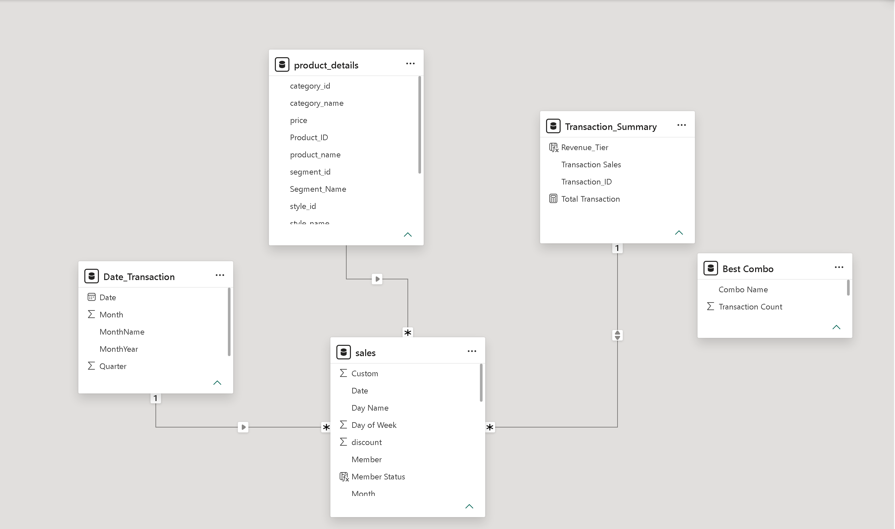

# Balanced-Tree-Clothing-Project
## Overview
Dataset: 8 Week SQL Challenge – Case Study #7 (Balanced Tree Clothing Co.
Balanced Tree Clothing Co. needs to optimize its merchandising strategy and understand customer purchasing patterns. This project analyzes 15,095 sales line items across 2,500 unique transactions to uncover actionable insights regarding revenue generation, product performance, and customer loyalty.

**Key outcomes:**
- Processed and modeled structured transaction data using PostgreSQL.
- Identified the most profitable product segments and frequent 3-item baskets to drive cross-selling campaigns.

## Tools & Techniques
- Database: PostgreSQL
- DAX, Power Query
- Visualization: Power BI - [Power BI Dashboard File](Balanced_Tree.pbix) 
- SQL Techniques: CTEs, Subqueries, Window Functions, Self-Joins

## Database Schema

Note: Streamlined the original 4-table schema into a Fact-Dimension model for efficient Power BI integration.

## Analysis & SQL Queries

### 1. High Level Sales Analysis
**Q1. What was the total quantity for all products?**

```sql
SELECT SUM(qty) AS Total_quantity
FROM balanced_tree.sales;
```


**Q2. What is the total generated revenue for all products before discounts?**
```sql
SELECT SUM(QTY*PRICE) AS Total_Generated_Revenue
FROM balanced_tree.sales
```


**Q3. What was the total discount amount for all products?**
```sql
SELECT SUM(QTY*PRICE*DISCOUNT/100) AS Total_Discount_Amount
FROM balanced_tree.sales
```


### 2. Transaction Analysis
**Q1. How many unique transactions were there?**
```sql
SELECT COUNT(DISTINCT txn_id) AS Unique_Transaction
FROM balanced_tree.sales
```


**Q2. What is the average unique products purchased in each transaction?**
```sql
WITH transaction_products AS(
 SELECT
   txn_id,
   COUNT(DISTINCT prod_id) AS Unique_Count
 FROM balanced_tree.sales
 GROUP BY txn_id
)
 SELECT
   ROUND(AVG(Unique_Count * 1.0),2) AS Avg_Unique_Products_Per_Transaction
 FROM transaction_products
```


**Q3. What are the 25th, 50th and 75th percentile values for the revenue per transaction?**
```sql
WITH transaction_revenue AS(
  SELECT
    txn_id,
    SUM(QTY*PRICE) AS Total_Generated_Revenue
  FROM balanced_tree.sales
  GROUP BY txn_id
)
SELECT
   PERCENTILE_CONT(0.25) WITHIN GROUP (ORDER BY Total_Generated_Revenue) AS percentile_25,
   PERCENTILE_CONT(0.50) WITHIN GROUP (ORDER BY Total_Generated_Revenue)
AS percentile_50,
   PERCENTILE_CONT(0.75) WITHIN GROUP (ORDER BY Total_Generated_Revenue)
AS percentile_75
FROM transaction_revenue
```


**Q4. What is the average discount value per transaction?**
```sql
WITH transaction_discount AS(
  SELECT
    txn_id,
    SUM(QTY*PRICE*DISCOUNT/100) AS Total_Discount
  FROM balanced_tree.sales
  GROUP BY txn_id
)
SELECT (AVG(Total_Discount) 
FROM transaction_discount
```


**Q5. What is the percentage split of all transactions for members vs non-members?**
```sql
WITH member_transaction AS(
  SELECT
    MEMBER,
    COUNT(DISTINCT txn_id) AS Unique_Transaction_Count
  FROM balanced_tree.sales
  GROUP BY MEMBER
)
SELECT
  MEMBER,
  Unique_Transaction_Count,
  ROUND(Unique_Transaction_Count*100.0/SUM(Unique_Transaction_Count) OVER(), 2) AS Percentage_Split
  FROM member_transaction
```


**Q6. What is the average revenue for member transactions and non-member transactions?**
```sql
WITH transaction_revenue AS(
  SELECT
    MEMBER,
    txn_id,
    SUM(QTY*PRICE) AS revenue_per_txn
  FROM balanced_tree.sales
  GROUP BY MEMBER, txn_id
)
  SELECT
    MEMBER,
    ROUND(AVG(revenue_per_txn), 2) AS avg_revenue
  FROM transaction_revenue
  GROUP BY MEMBER
```


### 3. Product Analysis
**Q1. What are the top 3 products by total revenue before discount?**
```sql
SELECT 
  prod_id,
  SUM(QTY*PRICE) AS Total_Generated_Revenue
FROM balanced_tree.sales
GROUP BY prod_id
ORDER BY Total_Generated_Revenue DESC
LIMIT 3
```


**Q2. What is the total quantity, revenue and discount for each segment?**
```sql
SELECT
 segment_name,
 SUM(s.QTY) AS Total_Quantity,
 SUM(QTY*s.PRICE) AS Total_Generated_Revenue,
 SUM(QTY*s.PRICE*DISCOUNT/100) AS Total_Discount
FROM balanced_tree.sales AS s
JOIN balanced_tree.product_details AS p ON p.product_id = s.prod_id
GROUP BY segment_name
```


**Q3. What is the top selling product for each segment?**
```sql
WITH ranked_prod AS(
  SELECT 
    p.segment_name,
    p.product_name,
    SUM(s.QTY) AS Total_Quantity,
    DENSE_RANK()OVER(PARTITION BY p.segment_name ORDER BY SUM(s.QTY) DESC) AS rank_number
  FROM balanced_tree.sales AS s
  JOIN balanced_tree.product_details AS p ON p.product_id = s.prod_id
  GROUP BY p.segment_name, p.product_name
)
SELECT
   rank_number,
   segment_name,
   product_name,
   Total_Quantity
FROM ranked_prod
WHERE rank_number = 1
```


**Q4. What is the total quantity, revenue and discount for each category?**
```sql
SELECT
 category_id,
 SUM(s.QTY) AS Total_Quantity,
 SUM(QTY*s.PRICE) AS Total_Generated_Revenue,
 SUM(QTY*s.PRICE*DISCOUNT/100) AS Total_Discount
FROM balanced_tree.sales AS s
JOIN balanced_tree.product_details AS p ON p.product_id = s.prod_id
GROUP BY category_id
```


**Q5. What is the top selling product for each category?**
```sql
WITH ranked_prod AS(
  SELECT 
    p.category_id,
    p.product_name,
    SUM(s.QTY) AS Total_Quantity,
    DENSE_RANK()OVER(PARTITION BY p.category_id ORDER BY SUM(s.QTY) DESC) AS rank_number
  FROM balanced_tree.sales AS s
  JOIN balanced_tree.product_details AS p ON p.product_id = s.prod_id
  GROUP BY p.category_id, p.product_name
)
SELECT
   rank_number,
   category_id,
   product_name,
   Total_Quantity
FROM ranked_prod
WHERE rank_number = 1
```


**Q6. What is the percentage split of revenue by product for each segment?**
```sql
WITH product_revenue AS(
  SELECT 
    p.product_name,
    p.segment_name,
    SUM(QTY*s.PRICE) AS Total_Generated_Revenue
  FROM balanced_tree.sales AS s
  JOIN balanced_tree.product_details AS p ON p.product_id = s.prod_id
  GROUP BY p.segment_name, p.product_name
)
SELECT
   product_name,
   segment_name,
   ROUND(Total_Generated_Revenue*100.0/ SUM(Total_Generated_Revenue) OVER(PARTITION BY segment_name), 2 ) AS revenue_percentage
FROM product_revenue
ORDER BY revenue_percentage, segment_name DESC 
```


**Q7. What is the percentage split of revenue by segment for each category?**
```sql
WITH segment_revenue AS(
  SELECT 
    p.category_name,
    p.segment_name,
    SUM(QTY*s.PRICE) AS Total_Generated_Revenue
  FROM balanced_tree.sales AS s
  JOIN balanced_tree.product_details AS p ON p.product_id = s.prod_id
  GROUP BY p.category_name, p.segment_name
)
SELECT
   category_name,
   segment_name,
   ROUND(Total_Generated_Revenue*100.0/ SUM(Total_Generated_Revenue) OVER(PARTITION BY category_name), 2 ) AS revenue_percentage
FROM segment_revenue
ORDER BY category_name,revenue_percentage DESC
```


**Q8. What is the percentage split of total revenue by category?**
```sql
WITH category_revenue AS(
  SELECT
    p.category_name,
    SUM(s.QTY*s.PRICE) AS Total_Generated_Revenue
  FROM balanced_tree.sales AS s
  JOIN balanced_tree.product_details AS p ON p.product_id = s.prod_id
  GROUP BY p.category_name
)
SELECT
  category_name ,
  ROUND(Total_Generated_Revenue*100.0/SUM(Total_Generated_Revenue) OVER(), 2) AS revenue_percentage
FROM category_revenue
ORDER BY revenue_percentage, category_name DESC
```


**Q9. What is the total transaction “penetration” for each product? (hint: penetration = number of transactions where at least 1 quantity of a product was purchased divided by total number of transactions)**
```sql
SELECT 
  p.product_name,
  ROUND(
    COUNT(s.txn_id) * 100.0 /(SELECT COUNT(DISTINCT txn_id)FROM balanced_tree.sales), 2) AS penetration_percentage
FROM balanced_tree.sales AS s
JOIN balanced_tree.product_details AS p ON s.prod_id = p.product_id
GROUP BY p.product_name
ORDER BY penetration_percentage DESC
```


**Q10. What is the most common combination of at least 1 quantity of any 3 products in a 1 single transaction?**
```sql
WITH txn_products AS (
  SELECT 
    s.txn_id, 
    p.product_id, 
    p.product_name
  FROM balanced_tree.sales AS s
  JOIN balanced_tree.product_details AS p 
    ON s.prod_id = p.product_id
)
SELECT 
  a.product_name AS product_1,
  b.product_name AS product_2,
  c.product_name AS product_3,
  COUNT(*) AS times_bought_together
FROM txn_products AS a
JOIN txn_products AS b ON a.txn_id = b.txn_id AND a.product_id < b.product_id
JOIN txn_products AS c ON a.txn_id = c.txn_id AND b.product_id < c.product_id
GROUP BY 
  a.product_name, 
  b.product_name, 
  c.product_name
ORDER BY times_bought_together DESC
LIMIT 1
```


## Key Findings & Recommendations

> **Scope:** 2,500 transactions (15,095 line items) across 12 products, Jan 1 – Mar 30, 2021. All figures are calculated from `sales.csv`. Revenue is shown before discounts unless stated otherwise.

### Key Findings

**1. Revenue and discounts**
- Gross revenue: **$1,289,453** (45,216 units sold). Discounts: **$156,229** (12.1% of gross), leaving net revenue of about **$1,133,224**.
- Average basket: **$515.78** (median $509.50; 25th–75th percentile $375.75–$647.00) with **6.04** unique products per transaction.

**2. Members vs. non-members**

| Group | Transactions | Share of transactions | Share of revenue | Avg. revenue per transaction | Avg. discount per transaction |
|---|---|---|---|---|---|
| Member | 1,505 | 60.2% | 60.3% | $516.27 | $62.13 |
| Non-member | 995 | 39.8% | 39.7% | $515.04 | $63.04 |

Members generate the majority of transactions, but their baskets are virtually the same size as non-members' and they receive the same average discount. Membership drives **reach and frequency, not larger baskets**.

**3. Product and category mix**
- Men's items generate **55.4%** of revenue ($714,120), women's items **44.6%** ($575,333).
- Two segments, **Men's Shirts (31.5%)** and **Women's Jackets (28.5%)**, account for **60%** of revenue. Women's Jeans are the smallest segment (16.2%).
- The top 3 products by revenue are Blue Polo Shirt – Mens ($217,683), Grey Fashion Jacket – Womens ($209,304) and White Tee Shirt – Mens ($152,000). Together they make up **44.9%** of revenue.
- Units sold per product are close (3,646–3,876) and every product appears in about half of all transactions (49.7%–51.2% penetration). The revenue ranking is therefore driven mainly by **price, not popularity**.

**4. Product combinations**
- The most frequent 3-product basket is **White Tee Shirt – Mens + Grey Fashion Jacket – Womens + Teal Button Up Shirt – Mens**, found in **352 transactions (14.08%)**.
- The margin is thin. The next two combinations appear in 13.96% and 13.88% of transactions, and the data contains 220 distinct 3-product combinations. Given each product's ~50% penetration, independent purchasing would already produce this triple in about 12.9% of transactions, so the lift is only **~1.1x**. This is a weak signal, not a strong affinity.

### Recommendations

1. **Test the top combination as a bundle before rolling it out.** Run an A/B test (bundle offer vs. no offer) and compare basket value and conversion. Because the combination mixes men's and women's items and its lift is small, also test bundles within one category, for example a men's shirt with men's socks.
2. **Use membership to increase purchase frequency rather than discount depth.** Members already make up 60% of transactions but spend no more per basket, and discounts are applied almost equally to both groups. Add a sign-up incentive at checkout to convert the 39.8% non-member share, and reward repeat purchases (points, early access) instead of raising discounts.
3. **Focus campaigns on the high-revenue, price-driven products.** Feature Blue Polo Shirt, Grey Fashion Jacket and the Men's Shirt segment in promotions and homepage placement, and test pairing Women's Jeans (lowest revenue share) with Women's Jackets to lift their contribution.

### Limitations
- The data covers only three months, so seasonality cannot be assessed.
- There is no cost or margin data. "Top" and "best-selling" refer to revenue and volume, not profitability.


